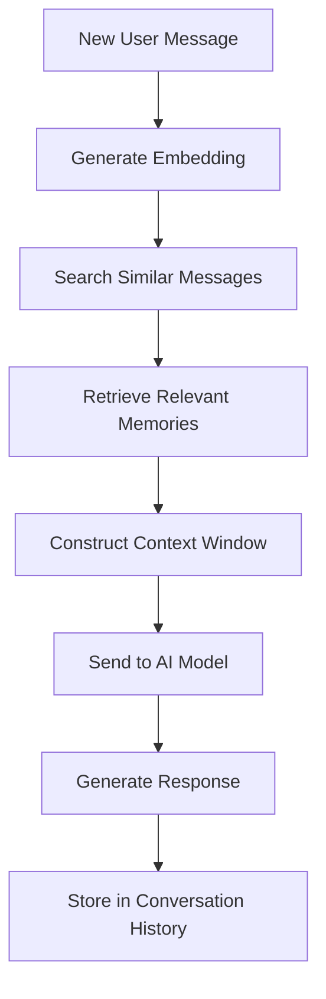

# Long-Term Memory ChatGPT Clone - Architecture Plan

## System Overview

This document outlines the architecture for implementing a ChatGPT clone with long-term memory capabilities. The system will store conversation histories, retrieve relevant past interactions, and use them to generate contextually appropriate responses.

## Key Components

### 1. Database Schema Design

```javascript
// User Schema
{
  _id: ObjectId,
  username: String,
  createdAt: Date,
  lastActive: Date
}

// Conversation Schema
{
  _id: ObjectId,
  userId: ObjectId, // Reference to User
  title: String,
  createdAt: Date,
  updatedAt: Date,
  isActive: Boolean
}

// Message Schema
{
  _id: ObjectId,
  conversationId: ObjectId, // Reference to Conversation
  role: String, // "user" or "assistant"
  content: String,
  timestamp: Date,
  embedding: [Number] // Vector representation for similarity search
}

// Memory Summary Schema (for long-term storage)
{
  _id: ObjectId,
  userId: ObjectId,
  summary: String,
  keywords: [String],
  importance: Number, // 0-1 scale
  createdAt: Date,
  lastAccessed: Date
}
```

### 2. Memory Management System

The memory system will have three tiers:
1. **Short-term memory**: Recent conversation context (last 5-10 messages)
2. **Medium-term memory**: Summarized conversations from the past week
3. **Long-term memory**: Important summarized memories with embeddings

### 3. Memory Retrieval Flow



### 4. API Endpoints

```
POST /api/chat - Send a message and get a response
GET /api/conversations - Get all conversations for a user
GET /api/conversations/:id - Get a specific conversation
DELETE /api/conversations/:id - Delete a conversation
GET /api/memories - Get long-term memories
```

### 5. Key Technologies

- **Node.js/Express**: Backend framework
- **MongoDB**: Primary database with vector search capabilities
- **OpenAI API**: For generating chat responses
- **Sentence Transformers**: For generating embeddings (or OpenAI embeddings)

## Implementation Steps

1. **Database Models**: Create Mongoose models for users, conversations, messages, and memories
2. **Memory Storage**: Implement systems to store conversation history
3. **Embedding Generation**: Integrate with embedding service for semantic search
4. **Memory Retrieval**: Build algorithms to fetch relevant memories
5. **API Layer**: Create RESTful endpoints for chat interactions
6. **AI Integration**: Connect with OpenAI API for response generation
7. **Frontend**: Create a simple chat interface
8. **Testing**: Validate memory retention and retrieval accuracy

## Memory Consolidation Strategy

To prevent memory overload:
1. Automatically summarize conversations after a certain length
2. Assign importance scores to memories based on content
3. Periodically archive older conversations
4. Implement a forgetting curve for less important memories